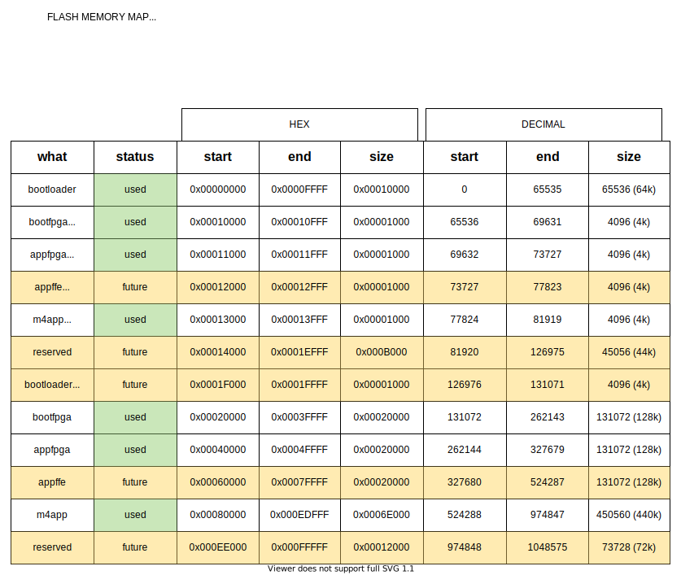

TinyFPGA-Programmer-Application
===============================

Desktop application for programming TinyFPGA boards. Updated to python3 and to support QuickLogic's QuickFeather.

Installation
------------

Note: This repository uses sub-modules for some of the functionality. Using the "Download ZIP" functionality does not package these necessary sub-modules. To use this project, please follow the instatllation instructions given below.

1. Clone the repository and install the tinyfpgab dependency
   ::

    git clone --recursive https://github.com/QuickLogic-Corp/TinyFPGA-Programmer-Application.git    
    pip3 install tinyfpgab

2. | Connect the QuickFeather board, and set it to flash mode.
   | To put it into flash mode, press the `RST` button, and the LED should turn blue and start flashing.  
   | Press the `USR` button within 5 seconds of pressing the `RST` button. The LED will turn green and go into breathing mode.  
   | At this point, run :code:`lsusb` on the terminal.  
   | :code:`lsusb` should contain an entry similar to the following:

   ::

     Bus 002 Device 029: ID 1d50:6140 OpenMoko, Inc.
   
   | or

   ::

     Bus 002 Device 029: ID 1d50:6130 OpenMoko, Inc.

   | If the OpenMoko device is not present, then run the following commands.

   ::

     pip3 install apio
     apio drivers --serial-enable
   
   | You should see:

   ::

     Serial drivers enabled
     Unplug and reconnect your board
   
   | and then check the output of :code:`lsusb` contains an entry as shown above.

3. | It is recommended to set up an alias to simplify programming using the editor of your choice to edit :code:`~/.bashrc`:
   | Change `/PATH/TO/BASE/DIR/` to wherever you cloned this git repo.
   
   ::

     alias qfprog="python3 /PATH/TO/BASE/DIR/TinyFPGA-Programmer-Application/tinyfpga-programmer-gui.py"
     source ~/.bashrc

Programming
-----------

| This version of tinyfpga-programmer-gui.py is restricted to CLI mode.  
| CLI mode allows you to specify which port to use, and thus works even when the system does not report USB VID and PID.  
| This document focuses on CLI mode.
|

**NOTE**

| **If the use-case involves loading the appfpga binary (with or without the m4app binary) which is now supported in this programmer application, then the bootloader needs to be updated on the QuickFeather first**
| The latest version of the bootloader can be built in the qorc-sdk (qf_apps/qf_bootloader or qf_apps/qf_bootloader_uart).
| This needs to be first flashed using the programmer application to ensure support for load of the appfpga binary and the operating-mode spec (detailed below).
| :code:`qfprog --port /dev/ttyX --bootloader /path/to/latest/qorc-sdk/qf_bootloader.bin --mode m4`
|
| If the original bootloader is continued to be used, the :code:`--mode` and the :code:`--appfpga` options will have no effect.
| The (original)bootloader will always try to load the m4app binary only.

Help is available by running with the --help parameter:

::

  python3 tinyfpga-programmer-gui --help

or, if you have already setup the alias

::

  qfprog --help

::

    usage: tinyfpga-programmer-gui.py [-h] --mode [fpga-m4] [--m4app app.bin]
                                    [--appfpga appfpga.bin]
                                    [--bootloader boot.bin]
                                    [--bootfpga fpga.bin] [--reset]
                                    [--port /dev/ttySx] [--crc] [--checkrev]
                                    [--update] [--mfgpkg qf_mfgpkg/]

    optional arguments:
    -h, --help            show this help message and exit
    --mode [fpga-m4]      operation mode - m4/fpga/fpga-m4
    --m4app app.bin       m4 application program
    --appfpga appfpga.bin
                            application FPGA binary
    --bootloader boot.bin, --bl boot.bin
                            m4 bootloader program WARNING: do you really need to
                            do this? It is not common, and getting it wrong can
                            make you device non-functional
    --bootfpga fpga.bin   FPGA image to be used during programming WARNING: do
                            you really need to do this? It is not common, and
                            getting it wrong can make you device non-functional
    --reset               reset attached device
    --port /dev/ttySx     use this port
    --crc                 print CRCs
    --checkrev            check if CRC matches (flash is up-to-date)
    --update              program flash only if CRC mismatch (not up-to-date)
    --mfgpkg qf_mfgpkg/   directory containing all necessary binaries

The programmer allows you to specify various options:

- | The :code:`--port port-name` option is used to tell the programmer which serial port the QuickFeather board is connected to. The form of *port-name* varies depending on the system: 
  | :code:`COM##` on PC/Windows
  | :code:`/dev/ttyS##` on PC/wsl1/Ubuntu18+ (where the ## is the same as the COM## shown by device manager under Windows)
  | :code:`/dev/ttyACM#` on PC/Ubuntu18+
  |

- | The :code:`--mode [operating-mode]` tells the programmer to set the "operating mode" for the bootloader to use.
  | The options currently supported are: :code:`--mode m4`, :code:`--mode fpga`, :code:`--mode fpga-m4`
  | This is used to let the bootloader identify the use case, and load the images accordingly.
  | If :code:`--mode m4` : then the bootloader will only load the m4app binary that has been flashed
  | If :code:`--mode fpga` : then the bootloader will only program the fpga using the appfpga binary that has been flashed
  | If :code:`--mode fpga-m4` : then the bootloader will program the fpga using the appfpga binary and then load the m4app binary that has been flashed
  | **NOTE 1.** The bootloader needs to be updated first before flashing any appfpga or m4app images!
  |      Example:
  |      :code:`qfprog --port /dev/ttyX --bootloader /path/to/latest/qorc-sdk/qf_bootloader.bin --mode m4`
  |      If not, then the :code:`--mode` option has no effect, and it always acts as if :code:`--mode m4` is specified.
  | **NOTE 2.** The :code:`--mode` argument is mandatory and must be always specified.

- The :code:`--m4app app.bin` tells the programmer to program the file *app.bin* as the m4 application

- The :code:`--appfpga appfpga.bin` tells the programmer to program the file *appfpga.bin* as the application fpga binary

- | The :code:`--reset` option tells the programmer to reset the board, which will result in the bootloader being restarted, and if the user button is not pressed, the bootloader will then laod and start the most recent m4app.
  | Example: 
  | :code:`qfprog --port /dev/ttyS8 --m4app output/bin/qf_helloworldsw.bin --reset --mode m4`
  | will program the m4app with qf_helloworldsw and then run it

- The :code:`--crc` option simply prints the crc values for each of binaries that are programmed into the flash memory

- | The :code:`--checkrev` option compares the crc for a binary specified as an option to the binary file progammed into the flash
  | Example: 
  | :code:`qfprog --port /dev/ttyS8 --m4app output/bin/qf_helloworldsw.bin --checkrev --mode m4`
  |  will compare the crc for file output/bin/qf_helloworldsw.bin with the crc for the binary programmed into the m4app location of the flash memory

- The :code:`--update` option causes the progammer to check the crc of any specified binary against the crc of the binary progammed into the flash, and only programmer the specified binary if it the crc is different

**Danger Zone**

- | The :code:`--bootloader boot.bin` option tells the programmer to program the file *boot.bin* as the bootloader application. 
  | **If the programming fails for any reason, or the boot.bin file doesn't work as expected the QuickFeather will become non-functional and only recoverable by using J-LINK.**
  |
   
- | The :code:`--bootfpga fpga.bin` option tells the programmer to program the file *fpga.bin* as the fpga image for the bootloader. 
  | **If the programming fails for any reason, or the fpga.bin file doesn't work as expected the QuickFeather will become non-functional and only recoverable by using J-LINK.**
  |
   
- | The :code:`--mfgpkg mfgpkg/` option can be used to update all of the QuickFeather firmware or restore it to the factory delivered state.  
  | The programmer expects the *mfgpkg/* directory will contain qf_bootloader.bin, qf_bootfpga.bin and qf_helloworldsw.bin.  
  | The recommended update method is to use the --update option with the --mfgpkg option
  |

Flash Memory Map
----------------

| The TinyFPGA programmer has a flash memory map for 5 bin files, and corresponding metadata (including CRC) for each of them.
| The flash memory map is defined for 2MB (16Mb) of flash memory (as in QuickFeather)

The 5 bin files are:

- bootloader
- bootfpga
- m4app
- appfpga
- appffe (for future use)
  
| The bootloader is loaded by a reset.
| It handles either communicating with the TinyFPGA-Programmer to load new bin files into the flash, or it loads appfpga and/or m4app and transfers control to it.
| The bootfpga area contains the binary for the fpga image that the bootloader uses.

The flash memory map defined for q-series devices is:

